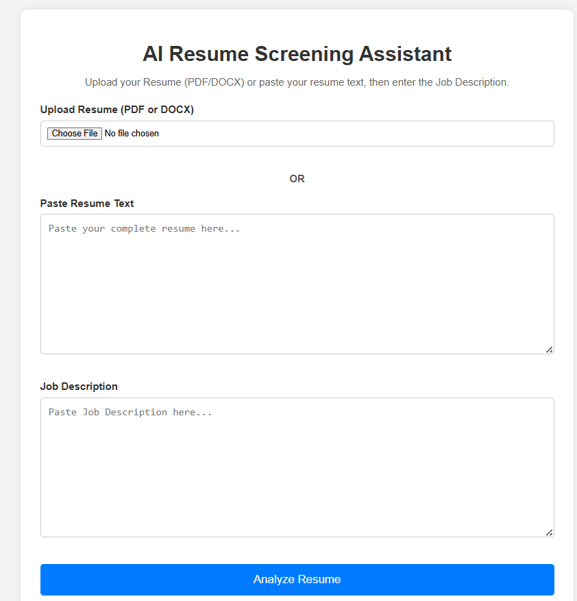
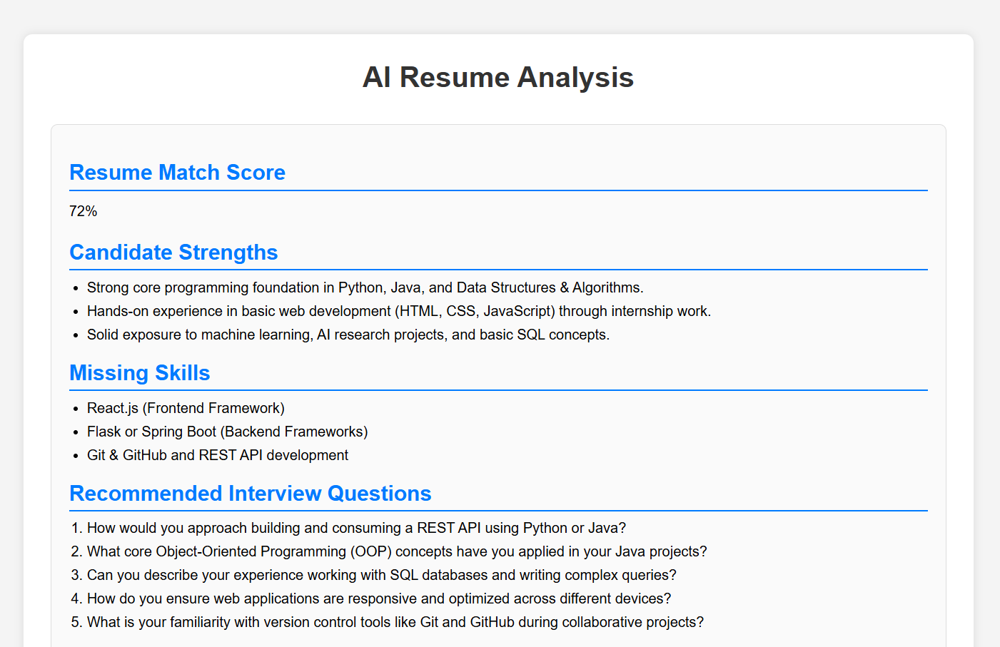
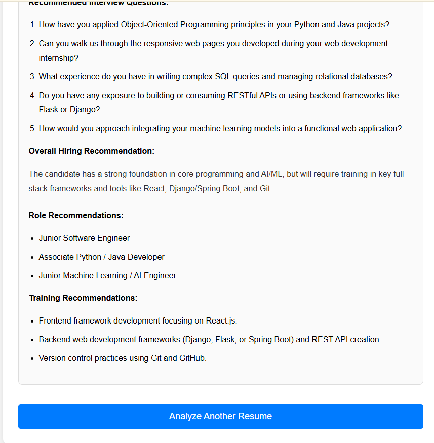

# AI Resume Screening Assistant

## Project Description

AI Resume Screening Assistant is a web application that compares a candidate's resume with a Job Description and generates AI-powered insights using Google Gemini AI.

## Features

- Upload Resume (PDF or DOCX)
- Paste Resume Text
- Enter Job Description
- Resume Match Score
- Candidate Strengths
- Missing Skills
- Interview Questions
- Hiring Recommendation
- Role Recommendations
- Training Recommendations

## Technologies Used

**Frontend**
- HTML
- CSS

**Backend**
- Python
- Flask

**AI**
- Google Gemini AI

**Libraries**
- Flask
- google-genai
- PyPDF2
- python-docx
- python-dotenv

## Screenshots

### Home Page



### Result Page 1



### Result Page 2



## How to Run

1. Clone the repository.
2. Install the required packages:

```bash
pip install -r requirements.txt
```

3. Add your Gemini API key in the `.env` file:

```env
GEMINI_API_KEY=YOUR_API_KEY
```

4. Run the application:

```bash
python app.py
```

5. Open your browser and visit:

```
http://127.0.0.1:5000
```
